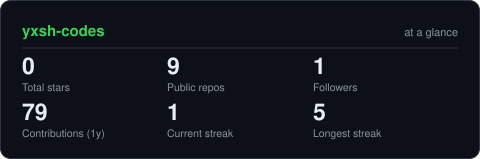
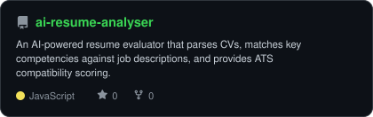
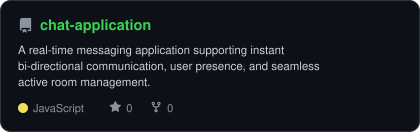
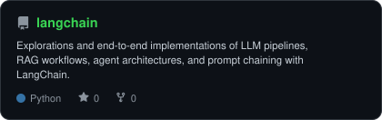

<div align="center">

<!-- PORTRAIT - generated by scripts/dotify.py from assets/jacket.png.
     Colour mode, so one file serves both GitHub themes. Regenerate with:
       python scripts/dotify.py assets/jacket.png -o assets/portrait \
         --cols 100 --equalize --detail 0.5 --color -->


<br>

<!-- NAME / TAGLINE - animated typing -->
<a href="https://github.com/yxsh-codes">
  
</a>

<br>

<!-- SOCIALS -->
<a href="https://www.linkedin.com/in/yash-chowrasia-5b2021341/"></a>
<a href="mailto:yashchowrasia0@gmail.com"></a>
<a href="https://codeforces.com/profile/yxshcodes"></a>
<a href="https://leetcode.com/u/Yxshh/"></a>

<br><br>


</div>

---

## `~/` whoami

```console
$ cat about.txt
```

Hi, I'm **Yash Chowrasia** a problem solver who loves coding and building things from the ground up.
I enjoy turning complex ideas into simple, scalable technical solutions.

- Currently building: **[GenAI](https://github.com/yxsh-codes/langchain)** and **[AgenticAI](https://github.com/yxsh-codes/langchain)** Workflows
<!-- - Portfolio: **[dossier-iota-one.vercel.app](https://dossier-iota-one.vercel.app)** -->
- Learning: **GenAI + AgenticAI**
- Fun fact: **I dive deepest into code and turn theoretical brainstorms into working solutions**

<br>

<div align="center">

## `~/` toolbox


</div>

---

<div align="center">

## `~/` skill radar

<table>
<tr>
<td width="50%" align="center" valign="middle">

<!-- Self-rated radar - edit assets/skills.json, the workflow redraws it -->
<picture>
  <source media="(prefers-color-scheme: dark)"  srcset="assets/radar-dark.svg">
  <source media="(prefers-color-scheme: light)" srcset="assets/radar-light.svg">
  
</picture>

</td>
<td width="50%" align="center" valign="middle">

<!-- Live radar built from real language byte counts across your repos -->
<picture>
  <source media="(prefers-color-scheme: dark)"  srcset="assets/radar-langs-dark.svg">
  <source media="(prefers-color-scheme: light)" srcset="assets/radar-langs-light.svg">
  
</picture>

</td>
</tr>
</table>

</div>

---

<!-- this was whole by gemini -->
<div align="center">

## `~/` contribution calendar

<!-- 3D isometric calendar, regenerated every 6h by .github/workflows/metrics.yml -->


<br><br>

<!-- Snake eats the contribution graph - .github/workflows/snake.yml -->
<picture>
  <source media="(prefers-color-scheme: dark)"  srcset="https://raw.githubusercontent.com/yxsh-codes/yxsh-codes/output/snake-dark.svg">
  <source media="(prefers-color-scheme: light)" srcset="https://raw.githubusercontent.com/yxsh-codes/yxsh-codes/output/snake.svg">
  
</picture>

</div>

---

<div align="center">

## `~/` the numbers

<!-- Generated by scripts/cards.py into this repo. Deliberately NOT
     github-readme-stats / streak-stats / github-profile-trophy: those are
     shared public instances that go down and take the whole section with them. -->
<picture>
  <source media="(prefers-color-scheme: dark)"  srcset="assets/card-stats-dark.svg">
  <source media="(prefers-color-scheme: light)" srcset="assets/card-stats-light.svg">
  
</picture>

<br>


<br><br>


</div>

---

<div align="center">

## `~/` selected work

<!-- Cards generated by scripts/cards.py from assets/projects.json.
     Stars, forks and language are pulled live from the API on every run. -->
<table>
<tr>
<td width="50%">
  <a href="https://github.com/yxsh-codes/ai-resume-analyser">
    <picture>
      <source media="(prefers-color-scheme: dark)"  srcset="assets/card-ai-resume-analyser-dark.svg">
      <source media="(prefers-color-scheme: light)" srcset="assets/card-ai-resume-analyser-light.svg">
      
    </picture>
  </a>
</td>
<td width="50%">
  <a href="https://github.com/yxsh-codes/chat-application">
    <picture>
      <source media="(prefers-color-scheme: dark)"  srcset="assets/card-chat-application-dark.svg">
      <source media="(prefers-color-scheme: light)" srcset="assets/card-chat-application-light.svg">
      
    </picture>
  </a>
</td>
</tr>
<tr>
<td width="50%" colspan="2" align="center">
  <a href="https://github.com/yxsh-codes/langchain">
    <picture>
      <source media="(prefers-color-scheme: dark)"  srcset="assets/card-langchain-dark.svg">
      <source media="(prefers-color-scheme: light)" srcset="assets/card-langchain-light.svg">
      
    </picture>
  </a>
</td>
</tr>
</table>

<sub>

| project | live / demo | stack |
|---|---|---|
| **[ai-resume-analyser](https://github.com/yxsh-codes/ai-resume-analyser)** | [github.com/yxsh-codes/ai-resume-analyser](https://github.com/yxsh-codes/ai-resume-analyser) | `Python` `Streamlit` `LLMs` |
| **[chat-application](https://github.com/yxsh-codes/chat-application)** | [github.com/yxsh-codes/chat-application](https://github.com/yxsh-codes/chat-application) | `Node.js` `Socket.io` `JavaScript` |
| **[langchain](https://github.com/yxsh-codes/langchain)** | [github.com/yxsh-codes/langchain](https://github.com/yxsh-codes/langchain) | `Python` `LangChain` `RAG` |

</sub>

</div>

---

<div align="center">

<sub>`01110100 01101000 01100001 01101110 01101011 01110011 00100000 01100110 01101111 01110010 00100000 01110011 01100011 01110010 01101111 01101100 01101100 01101001 01101110 01100111`</sub>

</div>
